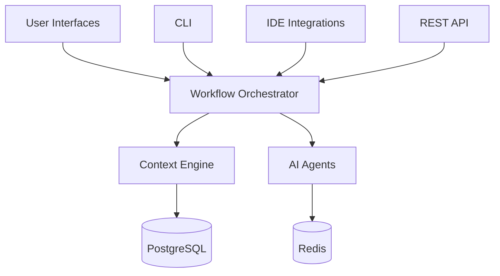

# Architecture Overview

> **Figure:** High-level component diagram.

The system is divided into three primary layers:

1. **Interface Layer** – Web UI, CLI, IDE plugins & REST API.
2. **Orchestration Layer** – Coordinates workflows, tasks and events.
3. **Agent Layer** – Specialized AI agents executing domain-specific responsibilities.

See the repository’s `memory-bank/systemPatterns.md` for deeper insights into design patterns.